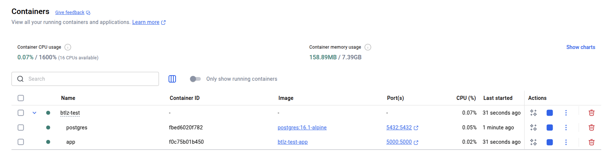
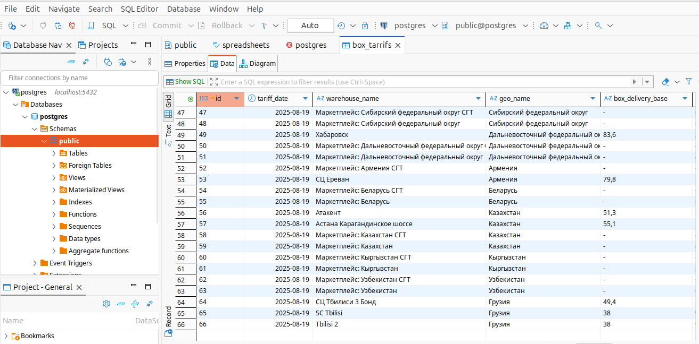
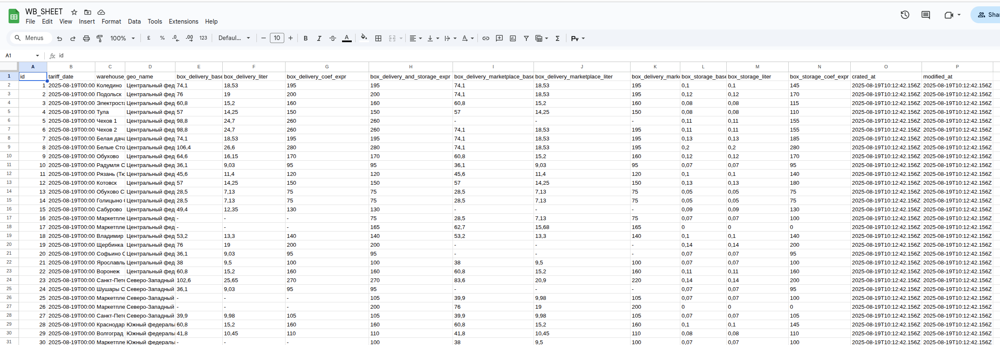

# Шаблон для выполнения тестового задания

## Описание

Шаблон подготовлен для того, чтобы попробовать сократить трудоемкость выполнения тестового задания.

В шаблоне настоены контейнеры для `postgres` и приложения на `nodejs`.  
Для взаимодействия с БД используется `knex.js`.  
В контейнере `app` используется `build` для приложения на `ts`, но можно использовать и `js`.

Шаблон не является обязательным!\
Можно использовать как есть или изменять на свой вкус.

Все настройки можно найти в файлах:

- compose.yaml
- dockerfile
- package.json
- tsconfig.json
- src/config/env/env.ts
- src/config/knex/knexfile.ts

## Настройка

Для запросов в wilbderies/api добавте ключ в `.env` файл в WB_API_KEY поле.

Для подключения к google sheets

1. Создайте проект в google cloud
2. Включите API для google sheets
3. Создайте сервисный аккаунт и скачайте ключ
4. Добавьте скаченный ключ в папку с проектом и переименуйте на ./google_key.json. В .env файле в GOOGLE_KEY_JSON_PATH укажите путь к файлу ./google_key.json (хард код решение для тестового проекта)
5. Добавьте id таблицы в `.env` файл в GOOGLE_SHEET_ID поле
6. В share файла google sheet добавтье нав аккуант с правами на запись

## Заупукс проекта

Заполните .env файл по примеру example.env и по интсрукции в часте "Настройка"

Скачайте зависимости

```bash
npm install
```

Запустите бд

```bash
docker compose up -d --build postgres
```

Соберите проект

```bash
npm run build
```

Обновние все миграции

```bash
npm run knex migrate latest
```

Запустите проект

```bash
docker compose up -d --build app
```

## Итоговый резаультат

В Docker запущены два контейнера. Один с бд другой с приложением


Таблица в бд заполнена данными


В google sheets данные из бд


## Команды:

Запуск базы данных:

```bash
docker compose up -d --build postgres
```

Для выполнения миграций и сидов не из контейнера:

```bash
npm run knex:dev migrate latest
```

```bash
npm run knex:dev seed run
```

Также можно использовать и остальные команды (`migrate make <name>`,`migrate up`, `migrate down` и т.д.)

Для запуска приложения в режиме разработки:

```bash
npm run dev
```

Запуск проверки самого приложения:

```bash
docker compose up -d --build app
```

Для финальной проверки рекомендую:

```bash
docker compose down --rmi local --volumes
docker compose up --build
```

PS: С наилучшими пожеланиями!
